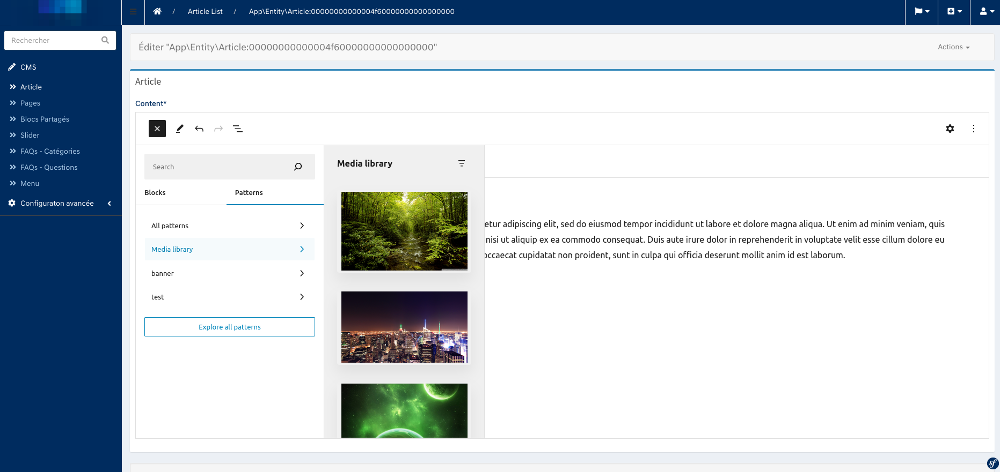

# Sonata Extra Bundle: Integrating Gutenberg Editor

## Introduction

Integrating the Gutenberg editor into Sonata involves using the 'Automatic Isolated block editor' library. This guide details the steps needed to install and configure the Gutenberg editor in your Sonata application.


## Screens





## Library Installation
The Gutenberg editor relies on a library from 'Automatic Isolated Block Editor'. You can download the library using the following link:
[Automatic Isolated Block Editor Library](https://github.com/Automattic/isolated-block-editor/archive/refs/heads/trunk.zip)


## Installation Steps

1. **Download and Install the Library**:

Use the command line to download and install the Gutenberg library assets:

```shell
bin/console sonata:extra:install-gutenberg
bin/console assets:install
```


2. **Add Gutenberg Widget Field in Twig Form Themes**:

Update your `twig.yaml` configuration to include the Gutenberg widget field:

```shell
#config/packages/twig.yaml
twig:
    form_themes:
        - '@PartitechSonataExtra/Form/gutenberg_field.html.twig'
```


## Using Gutenberg in Sonata Admin

### Configuring the Form Type

Implement the Gutenberg form type in your Sonata admin class:

```php
<?php

namespace App\Admin;

use App\Form\Type\GutenbergType;
use Sonata\AdminBundle\Form\FormMapper;
// ... other uses

class YourEntityAdmin extends AbstractAdmin
{
    protected function configureFormFields(FormMapper $formMapper)
    {
        $formMapper
            ->add('yourField', GutenbergType::class, [
                'label' => 'Your Field',
                // ... other options
            ]);
    }
}
```


### Gutenberg Blocks

The Gutenberg editor comes with a variety of default blocks:

**Text**
- "core/paragraph",
- "core/quote",
- "core/preformatted",
- "core/verse",
- "core/list",
- "core/list-item",

**Media**
- "core/image",
- "core/audio",
- "core/video",
- "core/gallery",
- "core/media-text",
- "core/file",
- "core/cover",

**Formatting**
- "core/code",
- "core/html",
- "core/pullquote",
- "core/table",
- "core/text-columns",

**Layout**
- "core/button",
- "core/buttons",
- "core/column",
- "core/columns",
- "core/group",
- "core/separator",
- "core/spacer",
- "core/page-list",
- "core/page-list-item",
- "core/navigation",
- "core/navigation-link",
- "core/navigation-submenu",

**Widgets**
- "core/archives",
- "core/calendar",
- "core/categories",
- "core/latest-comments",
- "core/latest-posts",
- "core/rss",
- "core/search",
- "core/shortcode",
- "core/social-link",
- "core/social-links",
- "core/tag-cloud",

**Embed**
- "core/embed",
- "core/block",
- "core/pattern",

**Site**
- "core/site-logo",
- "core/site-title",
- "core/site-tagline",
- "core/home-link",
- "core/loginout",

**Template**
- "core/query",
- "core/query-pagination",
- "core/query-pagination-next",
- "core/query-pagination-numbers",
- "core/query-pagination-previous",
- "core/query-no-results",
- "core/query-title",
- "core/template-part",

**Post**
- "core/post-title",
- "core/post-excerpt",
- "core/post-featured-image",
- "core/post-content",
- "core/post-author",
- "core/post-author-name",
- "core/post-date",
- "core/post-terms",
- "core/post-navigation-link",
- "core/post-template",
- "core/post-comments-form",
- "core/post-author-biography",

**Comments**
- "core/comments",
- "core/comment-author-name",
- "core/comment-content",
- "core/comment-date",
- "core/comment-edit-link",
- "core/comment-reply-link",
- "core/comment-template",
- "core/comments-title",
- "core/comments-pagination",
- "core/comments-pagination-next",
- "core/comments-pagination-numbers",
- "core/comments-pagination-previous",

**More**
- "core/more",
- "core/nextpage",
- "core/read-more",
- "core/details",
- "core/footnotes",
- "core/avatar",
- "core/missing",


## Media Upload

The media upload feature is enabled by default. You can override the media context as follows:


```php
$formMapper
    ->add('content', GutenbergType::class, [
        'label' => 'Content',
        'context' => 'default'
    ]);
```


## Customizing Allowed Blocks

You can specify which blocks are allowed:

```php
$formMapper
    ->add('content', GutenbergType::class, [
        'label' => 'Content',
        'allowed_blocks' => [
            "core/pattern",
            "core/categories",
            // ... other allowed blocks
        ],
    ]);
```


## Adding Custom Patterns

### Step 1: Create a Patterns Directory

To add custom patterns, create a directory within your project's configuration:

- Navigate to your configuration directory: `config/`
- Create a new directory named `patterns/`

### Step 2: Add Your Pattern Library

Inside the patterns directory, create your own pattern library:

- Create a subdirectory for your library: `config/patterns/my-library/`
- Inside this library directory, add your pattern files (e.g., `pattern1.php`). Files can be named as desired.

### Step 3: Define Pattern Files

Each pattern file should contain a PHP header and the Gutenberg block code. Here's an example header and block layout:

```php
<?php
/**
 * Title: My Test Pattern 1
 * Description: Example of a custom pattern
 * Categories: test
 */
?>
<!-- wp:group {"layout":{"type":"constrained","contentSize":"400px"}} -->
<div class="wp-block-group">
    <!-- wp:cover {"url":"[Image URL]","dimRatio":0,"isDark":false,"style":{"border":{"radius":"10px"}},"layout":{"type":"constrained"}} -->
    <div class="wp-block-cover is-light" style="border-radius:10px">
        <!-- Your block content -->
    </div>
    <!-- /wp:cover -->
</div>
<!-- /wp:group -->

```

Finaly, the structure should look like this :

```
--config<br>
-----patterns<br>
--------my-library<br>
-----------------patern1.php<br>
-----------------patern2.php<br>
``` 

### Step 4: Configure FormType

1. **Import GutenbergPatternsService**:

Import the `GutenbergPatternsService` in your admin class.

```
use App\Service\GutenbergPatternsService;
``` 

2. **Inject the Service**:

Use the `#[Required]` attribute to inject the `GutenbergPatternsService`:

```
#[Required]
public function required(GutenbergPatternsService $gutenbergPatterns): void {
    $this->gutenbergPatterns = $gutenbergPatterns;
}
``` 

3. **Configure the FormMapper*:

Retrieve the patterns and configure them in the `FormMapper`:

```
$patterns = $this->gutenbergPatterns->getPatterns(['my-library']);

$formMapper
    ->add('content', GutenbergType::class, [
        'label' => 'Content',
        'patterns' => $patterns,
        'context' => 'default',
        'allowed_blocks' => [
            "core/pattern",
            "core/categories",
            // ... other allowed blocks
        ],
    ])
;
```