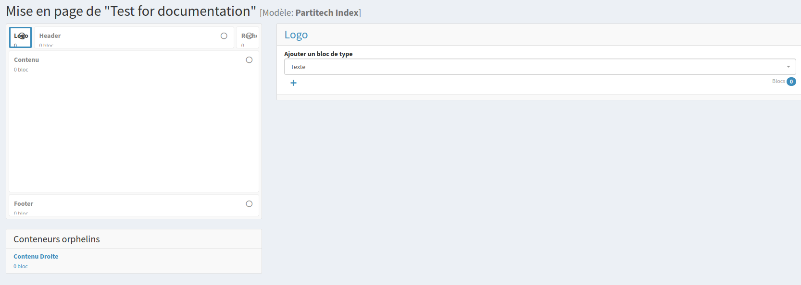

# Sonata Extra Bundle : Layout setup

## Introduction

Setting up your layout in SonataPage is a crucial step in creating a well-structured and visually appealing website. This guide will help you understand the layout configuration process within the SonataPage bundle.

## Prerequisite
Before proceeding, make sure you have read the main documentation of SonataPage:
[Read the SonataPage Documentation](https://github.com/sonata-project/SonataPageBundle/blob/4.x/docs/reference/page_composer.rst)

## Configuration Steps

### Step 1: Define Your Layout Configuration

Start by defining your layout in a YAML configuration file. Here is an example:

```yaml
partitech_index:
  path: 'demo_index.html.twig'
  name: 'Partitech Index'
  containers:
    logo:
      name: Logo
    header:
      name: Header
    recherche:
      name: Recherche
    content:
      name: Contenu
    footer:
      name: Footer
  matrix:
    layout: |
      LLHHHHHHHHHHHHHHHHRR
      CCCCCCCCCCCCCCCCCCCC
      CCCCCCCCCCCCCCCCCCCC
      CCCCCCCCCCCCCCCCCCCC
      CCCCCCCCCCCCCCCCCCCC
      CCCCCCCCCCCCCCCCCCCC
      CCCCCCCCCCCCCCCCCCCC
      FFFFFFFFFFFFFFFFFFFF
    mapping:
      L: logo
      H: header
      R: recherche
      C: content
      F: footer

```

### Step 2: Main Template Configuration

Set the path to your main template. This template will be used to render the entire page:

- **Path**: `layout_partitech_index.html.twig`

### Step 3: Configuring Containers

Define containers in the configuration. Containers are segments in your layout such as logo, header, content, etc.

- **Containers**: Define the containers and assign them names for easy identification.

### Step 4: Implement Containers in Template

Place these containers in your main template file using the following syntax:

```

{{ sonata_page_render_container('logo') }}
{{ sonata_page_render_container('header') }}
{{ sonata_page_render_container('recherche') }}
{{ sonata_page_render_container('content') }}

```

###  Step 5: Matrix and Mapping Configuration
Configure the matrix to represent the content layout and map the layout codes (L, H, R, C, F) to the respective containers.

- **Matrix**: This is the visual representation of your template layout, which aids in selecting containers in the Sonata admin interface.
- **Mapping**: Helps in linking the matrix layout codes to the defined containers.



###  Conclusion
By following these steps, you'll have a well-structured layout setup for your SonataPage. This setup will not only make your pages visually coherent but also streamline your workflow in managing page content and layout.
