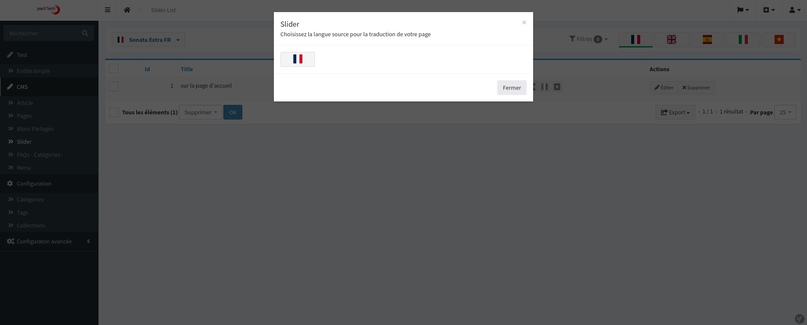
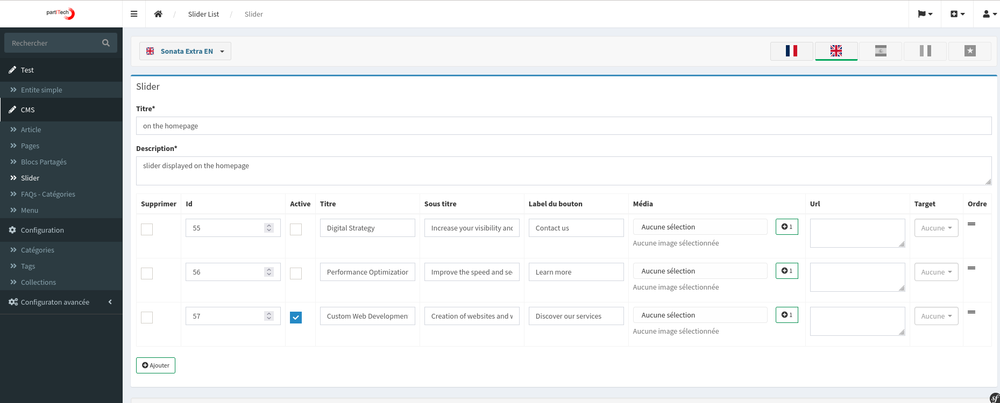

# Sonata Extra Bundle: Multilanguage Support for User Admins

This bundle facilitates multilanguage support for admin interfaces. It comprises a trait for admin classes to manage multilanguage interfaces, and a trait for entities to create necessary fields.

The implementation will add icons for the locales `from sonata_page` sites, enabling linkages with the records and managing all site languages.

## Screen
- List view of the translation in the selected language site

- Edit view of the translation in the selected language site

- Create a tranlsation from a local patern


## Implementation Example for a Simple Admin

### Entity File

```php
<?php

namespace App\Entity;

use App\Repository\SimpleTestRepository;
use Doctrine\ORM\Mapping as ORM;

use Partitech\SonataExtra\Traits\EntityTranslationTrait;

#[ORM\Entity(repositoryClass: SimpleTestRepository::class)]
class SimpleTest
{
    use EntityTranslationTrait;

    #[ORM\Id]
    #[ORM\GeneratedValue]
    #[ORM\Column]
    private ?int $id = null;

    // ...
}
```

### Admin File

```php
<?php

declare(strict_types=1);

namespace App\Admin;

use Partitech\SonataExtra\Attribute\AsAdmin;
use Sonata\AdminBundle\Admin\AbstractAdmin;
use Sonata\AdminBundle\Admin\AdminInterface;
use Sonata\AdminBundle\Datagrid\DatagridMapper;
use Sonata\AdminBundle\Datagrid\ListMapper;
use Sonata\AdminBundle\Form\FormMapper;
use Sonata\AdminBundle\Show\ShowMapper;

use Partitech\SonataExtra\Controller\Admin\TranslationController;
use Partitech\SonataExtra\Traits\AdminTranslationTrait;

#[AsAdmin(
    manager_type: 'orm',
    label: 'Simple Entity',
    model_class:  \App\Entity\SimpleTest::class,
)]
final class SimpleTestAdmin extends AbstractAdmin
{
    use AdminTranslationTrait;

    // ...
}
```

Note: Simply add the trait for both the admin and entity classes. Then run the following commands:
```shell
bin/console doctrine:schema:update --force
bin/console cache:clear
```

#### If you have allready a controller, just add the controller trait
```php
class MenuController extends Controller
{
use \Partitech\SonataExtra\Traits\ControllerTranslationTrait;
```

You can also call the create translation action  by using the extended controller as a service

```php
use \Partitech\SonataExtra\Controller\Admin\TranslationController;
class MenuController extends Controller
{
    use \Partitech\SonataExtra\Traits\ControllerTranslationTrait;

    private $TranslationController;

    #[Required]
    public function autowireDependencies(
        TranslationController $TranslationController
    ): void {

        $this->TranslationController = $TranslationController;
    }

    public function createTranslationAction($id, $from_site, $to_site, $fqcn): Response
    {
        return $this->TranslationController->createTranslationAction($id, $from_site, $to_site, $fqcn);
    }
```


## Admin Configure
The trait have its own configure. If you have a configure method in your admin, just be sure to call the trait configure as follows :
```php
#[AsAdmin(
    manager_type: 'orm',
    group: 'Admin',
    label: 'Test',
    model_class: \App\Entity\Test::class
)]

final class TestAdmin extends AbstractAdmin
{
    use AdminTranslationTrait;
    
    protected function configure(): void
    {
        $this->configureTrait();
        $this->setTemplate('edit', '@PartitechSonataMenu/CRUD/edit.html.twig');
    }

```

## Admin Route Configuration

The trait adds its own route for creating translations. If users also add routes, they should configure their routes as follows:
```php
#[AsAdmin(
    manager_type: 'orm',
    group: 'Admin',
    label: 'Test',
    model_class: \App\Entity\Test::class
)]
final class TestAdmin extends AbstractAdmin
{
    use AdminTranslationTrait;

    protected function configureRoutes(RouteCollectionInterface $collection): void
    {
        $this->configureTraitRoutes($collection);
        $collection->remove('show');
    }

    // ...
}
```

Call `configureTraitRoutes` to force the creation of necessary routes, then continue configuring your own routes. This is only necessary if `configureRoutes` is implemented in the admin class.

## Automatic Translation Compatibility

The multilanguage feature is compatible with our automatic translation tool through the 'Translation API' (see [smart_service.md](translation_api.md)).

Add a `#[Translatable]` annotation to make a field eligible for automatic translation via the API, using the application's provider (see [smart_service.md](translation_api.md)).
```php
use Partitech\SonataExtra\Attribute\Translatable;

#[ORM\Column(type: 'text', nullable: true)]
#[Translatable]
private ?string $description=null;


// ...
```
This feature is compatible with OneToMany relationships. In this case, add the annotation on both the entity relationship and the fields of the related entity.

Be aware that when a translation is done, process is to clone the object first, then translate it. The clone process can be done automatically for simple object, but the correct process should be to use the __clone strategy inside your entity.
Menu tree can not be cloned without an internal clone function.

### About Slug fields
As slug need to be unique, during the clone process, it will check if there is an `$object->getSlug()` function. If the method exist, the process verify that the term has been translated or not.
If the term is the same, it will prefix the value by its locale.
```php
    if (method_exists($clonedObject, 'setSlug') && $clonedObject->getSlug()==$object->getSlug()) {
        $slugger = new AsciiSlugger();
        $slug=$slugger->slug($this->site->getLocale().'-'.$clonedObject->getSlug())->lower();
        $clonedObject->setSlug($slug);
    }
```

## Sonata Classification multilang integration
Due to the specific integration of sonataTag and SonataCategory you will have to use our forked admin.

In sonata_classification.yaml configuration, keep your configuration as bellow :

```yaml
sonata_classification:
    class:
        category: App\Entity\SonataClassificationCategory
        collection: App\Entity\SonataClassificationCollection
        context: App\Entity\SonataClassificationContext
        tag: App\Entity\SonataClassificationTag
```

In your entity, make sure to add the trait :
- SonataClassificationTag.php
```php
<?php

declare(strict_types=1);

namespace App\Entity;

use Doctrine\ORM\Mapping as ORM;
use Doctrine\DBAL\Types\Types;
use App\Repository\SonataClassificationTagRepository;
use Sonata\ClassificationBundle\Entity\BaseTag;
use Partitech\SonataExtra\Traits\EntityTranslationTrait;
#[ORM\Entity(repositoryClass: SonataClassificationTagRepository::class)]
#[ORM\Table(name: 'classification__tag')]
#[ORM\HasLifecycleCallbacks]
class SonataClassificationTag extends BaseTag
{
    use EntityTranslationTrait;

    #[ORM\Id]
    #[ORM\Column(type: Types::INTEGER)]
    #[ORM\GeneratedValue]
    protected ?int $id = null;

    public function getId(): ?int
    {
        return $this->id;
    }
}

```

- SonataClassificationCategory.php

```php
<?php
namespace App\Entity;

use Doctrine\DBAL\Types\Types;
use Doctrine\ORM\Mapping as ORM;
use Sonata\ClassificationBundle\Entity\BaseCategory;
use Partitech\SonataExtra\Traits\EntityTranslationTrait;

#[ORM\Entity]
#[ORM\Table(name: 'classification__category')]
class SonataClassificationCategory extends BaseCategory
{
    use EntityTranslationTrait;
    #[ORM\Id]
    #[ORM\Column(type: Types::INTEGER)]
    #[ORM\GeneratedValue]
    protected ?int $id = null;

    public function getId(): ?int
    {
        return $this->id;
    }
}
```

Use sonata-extra tag and category admin.
**DO NOT USE tag and category admin from sonataClassification package. **
It wont have the tracking fields required for multilanguage.

- sonata_admin.yaml
```yaml
            cms:
                icon: fa fa-pencil
                label: CMS
                keep_open: true
                items:
                    - Partitech\SonataExtra\Admin\ArticleAdmin
                    - sonata.page.admin.page
                    - sonata.page.admin.shared_block
                    - Partitech\SonataExtra\Admin\SliderAdmin
                    - Partitech\SonataExtra\Admin\FaqCategoryAdmin
                    - Partitech\SonataExtra\Admin\TagAdmin
                    - Partitech\SonataExtra\Admin\CategoryAdmin
```